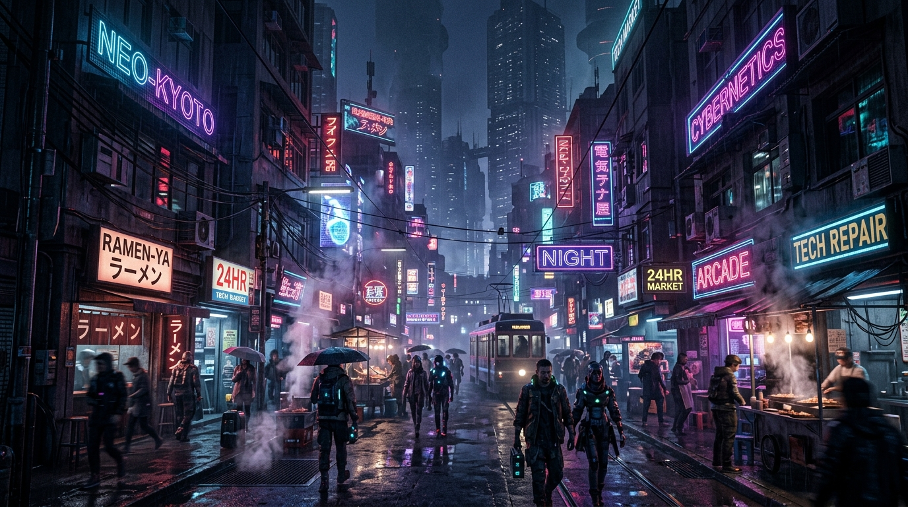

<div align="center">
  
# Cinematic Prompt Engine 🎬✨

**An enterprise-grade prompt compilation pipeline engineered to transform flat concepts into visually striking, photorealistic masterpieces for generative AI models.**

[](https://github.com/OmmprakashMohanty01/cinematic-prompt-engine/actions)
[](https://www.python.org/)
[](https://opensource.org/licenses/MIT)

</div>

---

## 🌟 Executive Summary

The **Cinematic Prompt Engine** is a robust, modular compiler designed to programmatically inject complex lighting, camera angles, and rendering constraints into base subjects. Built for scalable AI art generation workflows, it guarantees that generative AI outputs maintain a high degree of fidelity, artistic direction, and photorealism. 

By leveraging a structured Abstract Syntax Tree (AST) approach and aesthetic modifiers, it eliminates prompt engineering guesswork. Whether generating volumetric fog in a cyberpunk cityscape or anamorphic lens flares on a dark portrait, the engine systematically builds prompts that guide AI models to perfection.

### 🎨 Visual Outputs & Watermarking

Here is a glimpse of what the engine produces when its aesthetic modifiers and atmospheric lighting rules are applied. All outputs are automatically watermarked with custom `@op_x_visuals` signatures to ensure provenance and brand consistency.

<p align="center">
  
  
</p>
<p align="center">
  <em>Left: "Cyberpunk neon city street scene" generated with injected atmospheric lighting, volumetric fog, and photorealistic 8k modifiers.<br/>
  Right: "Rogue AI android" generated with custom bokeh, anamorphic lens flare, and dramatic chiaroscuro lighting modifiers.</em>
</p>

---

## 🚀 Core Architecture

The system is built on a scalable, typed Python backend that handles complex prompt compilation and asynchronous API communication.

- **Prompt Compilation Engine (`prompt_compiler.py`)**: Dynamically merges base subjects with environmental variables to create highly structured, AST-validated AI prompts.
- **Aesthetic Modifiers (`aesthetic_modifiers.py`)**: A configurable rule engine that applies predefined visual styles, cinematic lighting rigs (e.g., spotlights, FOV, chiaroscuro), and rendering parameters to guarantee a premium look.
- **Resilient API Integration (`api_client.py`)**: A robust API client implementation to send compiled prompts directly to generative AI endpoints with proper error handling, retries, and exponential backoff.

## 🛠 Tech Stack

- **Language:** Python 3.10+
- **Key Concepts:** Abstract Syntax Trees (AST) for prompt structuring, Asynchronous programming (`asyncio`), JSON data validation, strong typing, and structured logging.
- **CI/CD:** Automated testing and strict `flake8`/`ruff` linting via GitHub Actions.

## 💻 Setup & Usage

1. **Clone the repository:**
   ```bash
   git clone https://github.com/OmmprakashMohanty01/cinematic-prompt-engine.git
   cd cinematic-prompt-engine
   ```
2. **Configure your environment:**
   Ensure you have the required API keys configured (check the `api_client.py` for specific environment variables).
3. **Run the compiler:**
   ```bash
   python3 prompt_compiler.py --subject "A futuristic city" --style "cyberpunk" --watermark "@op_x_visuals"
   ```

## 🤝 Contributing

Contributions are welcome! Please check out the [Issues](https://github.com/OmmprakashMohanty01/cinematic-prompt-engine/issues) tab for `good first issue` tags if you'd like to get started.

## 📄 License

This project is licensed under the MIT License - see the LICENSE file for details.